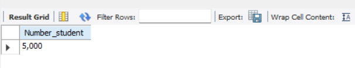
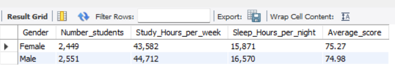
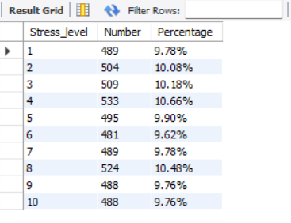
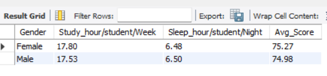
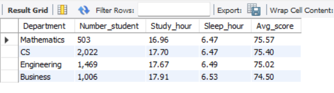
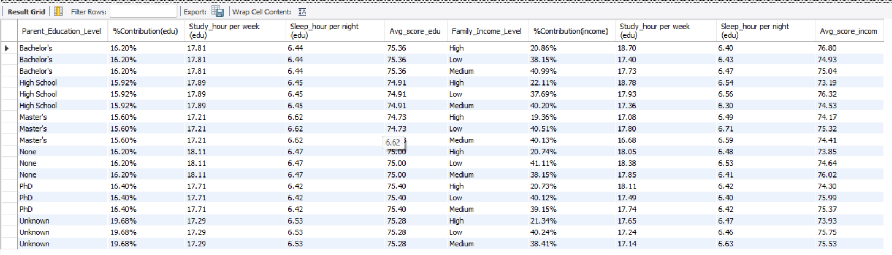
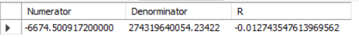
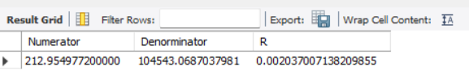
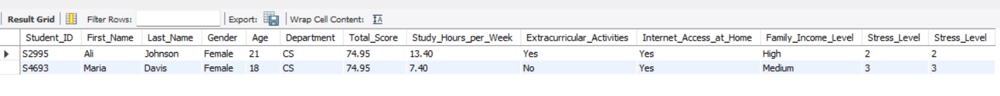

# Student Grades (Phân tích về tác động đến điểm số của học sinh) 📖

## Introduction (Giới thiệu) 📚


## Problems (Vấn đề) ⁉️

### Những yếu tố có thể tác động đến điểm số của học sinh:

1. Tính tổng số học sinh
2. Tính tổng số học sinh cùng với số giờ học, giờ ngủ và điểm trung bình dựa trên giới tính
3. Tìm tỷ lệ (%) theo mức độ stress
4. Tính trung bình giờ học, giờ ngủ và trung bình tổng điểm giữa nam và nữ
5. Tính trung bình giờ học, giờ ngủ và trung bình tổng điểm dựa trên ban, ngành
6. Tính trung bình giờ học, giờ ngủ và trung bình tổng điểm dựa trên cấp độ giáo dục của phụ huynh và thu nhập của gia đình
7. Tìm mối tương quan giữa số giờ học và điểm số
8. Tìm mối tương quan giữa số giờ ngủ và điểm số
9. Tìm thông tin của những học sinh có tổng điểm bằng trung vị của tổng điểm

## Tool I Used (Những công cụ sử dụng trong bài phân tích) ⚙️

- **MySQL :** Truy vấn dữ liệu
- **Power BI :** Trực quan hóa dữ liệu thành bảng biểu, biểu đồ
- **Github :** Đăng những bài phân tích cũng nhưng tài liệu đi kèm nhằm mục đích cho mọi người có thể truy cập, tham khảo

## The Analysis (Phân tích - Truy vấn) 📈
1. Tính tổng số học sinh
```sql
SELECT DISTINCT
  FORMAT(COUNT(*),'#,##0') Number_student
FROM Students_grade;
```


2. Tính tổng số học sinh cùng với số giờ học, giờ ngủ và điểm trung bình dựa trên giới tính
```sql
SELECT 
    Gender,
    FORMAT(COUNT(*), '#,##') Number_students,
    FORMAT(SUM(Study_Hours_per_Week), '#,##') Study_Hours_per_week,
    FORMAT(SUM(Sleep_Hours_per_Night), '#,##') Sleep_Hours_per_night,
    CONVERT(AVG(Total_Score), DECIMAL(5,2)) Average_score
FROM Students_grade 
GROUP BY Gender;
```


3. Tìm tỷ lệ (%) theo mức độ stress
```sql
SELECT 
    Stress_level,
    COUNT(*) Number,
    CONCAT(ROUND(COUNT(*) / (SELECT COUNT(*) FROM students_grade) * 100,2),'%') Percentage
FROM students_grade
GROUP BY stress_level
ORDER BY Stress_level;
```


4. Tính trung bình giờ học, giờ ngủ và trung bình tổng điểm giữa nam và nữ
```sql
WITH first_table AS
(SELECT
    Gender,
    COUNT(*) Number_student,
    SUM(study_hours_per_week) Study_hours,
    SUM(sleep_hours_per_night) Sleep_hours,
    AVG(total_score) Avg_Score
FROM Students_grade
GROUP BY Gender)
--
SELECT 
    Gender, 
    CONVERT(Study_hours / Number_student, DECIMAL(5,2)) 'Study_hour/student/Week',
    CONVERT(Sleep_hours / Number_student, DECIMAL(5,2)) 'Sleep_hour/student/Night',
    ROUND(Avg_Score,2) Avg_Score
FROM first_table;
```


5. Tính trung bình giờ học, giờ ngủ và trung bình tổng điểm dựa trên ban, ngành
```sql
WITH first_table AS
(SELECT
    Gender,
    COUNT(*) Number_student,
    SUM(study_hours_per_week) Study_hours,
    SUM(sleep_hours_per_night) Sleep_hours,
    AVG(total_score) Avg_Score
FROM Students_grade
GROUP BY Gender)
--
SELECT 
    Gender, 
    CONVERT(Study_hours / Number_student, DECIMAL(5,2)) 'Study_hour/student/Week',
    CONVERT(Sleep_hours / Number_student, DECIMAL(5,2)) 'Sleep_hour/student/Night',
    ROUND(Avg_Score,2) Avg_Score
FROM first_table;
```


6. Tính trung bình giờ học, giờ ngủ và trung bình tổng điểm dựa trên cấp độ giáo dục của phụ huynh và thu nhập của gia đình
```sql
WITH main_table as
(SELECT DISTINCT
    Parent_Education_Level,
    COUNT(*) OVER (PARTITION BY Parent_Education_Level) Number_student_edu,
    ROUND(AVG(total_score) OVER (PARTITION BY Parent_Education_Level),2) Avg_score_edu,
    SUM(Study_Hours_per_Week) OVER (PARTITION BY Parent_Education_Level) Study_hours_edu,
    SUM(Sleep_Hours_per_Night) OVER (PARTITION BY Parent_Education_Level) Sleep_hours_edu,
    Family_Income_Level,
    COUNT(*) OVER (PARTITION BY Parent_Education_Level, Family_Income_Level) Number_student_incom,
    ROUND(AVG(total_score) OVER (PARTITION BY Parent_Education_Level, Family_Income_Level),2) Avg_score_incom,
    SUM(Study_Hours_per_Week) OVER (PARTITION BY Parent_Education_Level, Family_Income_Level) Study_hours_incom,
    SUM(Sleep_Hours_per_Night) OVER (PARTITION BY Parent_Education_Level, Family_Income_Level) Sleep_hours_incom
FROM students_grade)
--
SELECT 
    Parent_Education_Level,
    CONCAT(ROUND(Number_student_edu / (SELECT COUNT(*) FROM students_grade) *100,2), '%') '%Contribution(edu)',
    ROUND(Study_hours_edu / Number_student_edu,2) 'Study_hour per week (edu)',
    ROUND(Sleep_hours_edu / Number_student_edu,2) 'Sleep_hour per night (edu)',
    Avg_score_edu,
    Family_Income_Level,
    CONCAT(ROUND(Number_student_incom / Number_student_edu *100,2), '%') '%Contribution(income)',
    ROUND(Study_hours_incom / Number_student_incom,2) 'Study_hour per week (edu)',
    ROUND(Sleep_hours_incom / Number_student_incom,2) 'Sleep_hour per night (edu)',
    Avg_score_incom
FROM main_table;
```


7. Tìm mối tương quan giữa số giờ học và điểm số
```sql
WITH avg_score as
  (SELECT AVG(Total_score) FROM Students_grade),
  avg_study_hour as
  (SELECT AVG(Study_hours_per_week) FROM Students_grade),
  calculate_table as
  (SELECT
    Student_Id,
    (Total_score - (SELECT * FROM avg_score)) as x1,
    (Study_hours_per_week - (SELECT * FROM avg_study_hour)) as x2
  FROM students_grade)
--
SELECT 
	SUM(`x1*x2`) Numerator,
  SUM(`(X1-X)^2`) * SUM(`(X2-X)^2`) Denorminator,
	SUM(`x1*x2`) / POWER(SUM(`(X1-X)^2`) * SUM(`(X2-X)^2`),0.5) R 
FROM
  (SELECT 
      Student_Id,
      x1 * x2 'x1*x2',
      POWER(x1,2) '(X1-X)^2', 
      POWER(x2,2) '(X2-X)^2'
  FROM calculate_table) final_table
```


8. Tìm mối tương quan giữa số giờ ngủ và điểm số
```sql
WITH avg_score as
  (SELECT AVG(Total_score) FROM Students_grade),
  avg_sleep_hour as
  (SELECT AVG(Sleep_Hours_per_Night) FROM Students_grade),
  calculate_table as
  (
  SELECT
  	Student_id,
    (Total_score - (SELECT * FROM avg_score)) x1,
    (Sleep_Hours_per_Night - (SELECT * FROM avg_sleep_hour)) x2
  FROM students_grade
  )
--
SELECT
    SUM(`x1*x2`) Numerator,
    POWER(SUM(`x1^2`) * SUM(`x2^2`),0.5) Denorminator,
    SUM(`x1*x2`) / POWER(SUM(`x1^2`) * SUM(`x2^2`),0.5) R
FROM
  (SELECT 
      Student_id,
      (x1 * x2) 'x1*x2',
      POWER(x1,2) 'x1^2',
      POWER(x2,2) 'x2^2'
  FROM calculate_table) as table1
```


9. Tìm thông tin của những học sinh có tổng điểm bằng trung vị của tổng điểm
```sql
WITH main_table as
  (SELECT 
  	ROW_NUMBER() OVER (ORDER BY Score ASC) Row_num,
    Score
  FROM 
    (SELECT DISTINCT
    	total_score Score
    FROM students_grade) as table1),
median_value as
(SELECT 
CASE
    WHEN COUNT(*) % 2 <> 0 THEN (COUNT(*) + 1) / 2
    ELSE COUNT(*) / 2
END Value1,
CASE
    WHEN COUNT(*) % 2 <> 0 THEN (COUNT(*) +1) /2
    ELSE (COUNT(*) + 2) / 2
END Value2
FROM main_table),
final_table as
(
SELECT * FROM main_table 
WHERE Row_num BETWEEN (SELECT Value1 FROM median_value) AND (SELECT Value2 FROM median_value)
)
--
SELECT 
    Student_ID, First_Name, Last_Name, Gender, Age, Department, Total_Score,
    Study_Hours_per_Week, Extracurricular_Activities, Internet_Access_at_Home, 
    Family_Income_Level, Stress_Level, Stress_Level
FROM Students_grade
WHERE total_score = (SELECT score FROM final_table)
```


## Conclusion 📝

## [Hình ảnh từ file Power BI](https://github.com/HuyNguyen255/Student_Grades/blob/bfb12fb119c8d845daf749716ad553e1bb29f6a6/Student_Grading.pbix)


